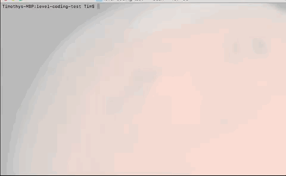

# level-coding-test

## Description
 A rover has recently landed on a plateau on Mars by NASA.  This particular plateau is curiously rectangular and must be navigated by the rover so that the on-board cameras can have a complete view of the surrounding terrain to send back to Mission Control on Earth.

 You have the ability to control the mars rover. Terminal will give instructions and allow you to input grid coordinates, deployment data, and movement instructions. Once you've entered your data, Terminal will let you know where the rover is now. 

 Sample Input:

 5 5

 1 2 N
 
 LMLMLMLMM

## Run Program:

- git clone https://github.com/tjking20/level-coding-test.git
- node app.js 

## Technologies

- ES6/JavaScript
- NodeJS
- GIT/Github

I chose to use es6 features for this projects to ensure they greates amount of readability. I created the rover along with rover methods as a class to increase ability to customize and reuse this code. The interface was created using NodeJS's native readline feature, which allows the app to prompt the user for each line. In this section I included methods for validating the user's input, allowing the app to reject non-usable inputs before creating the new rover object. 